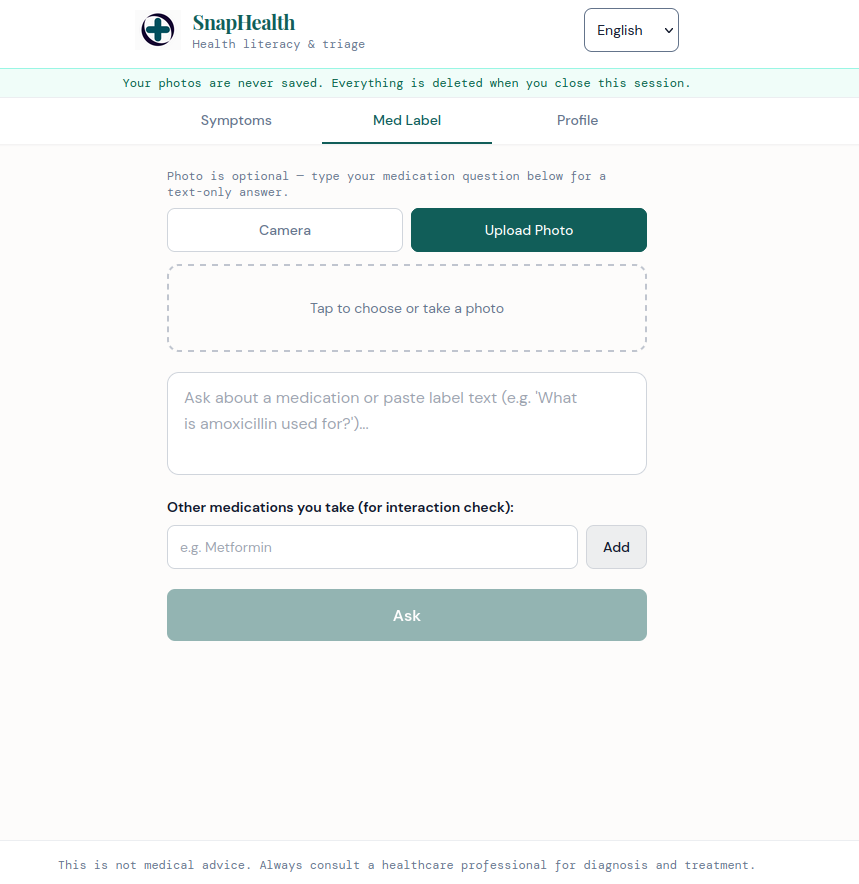
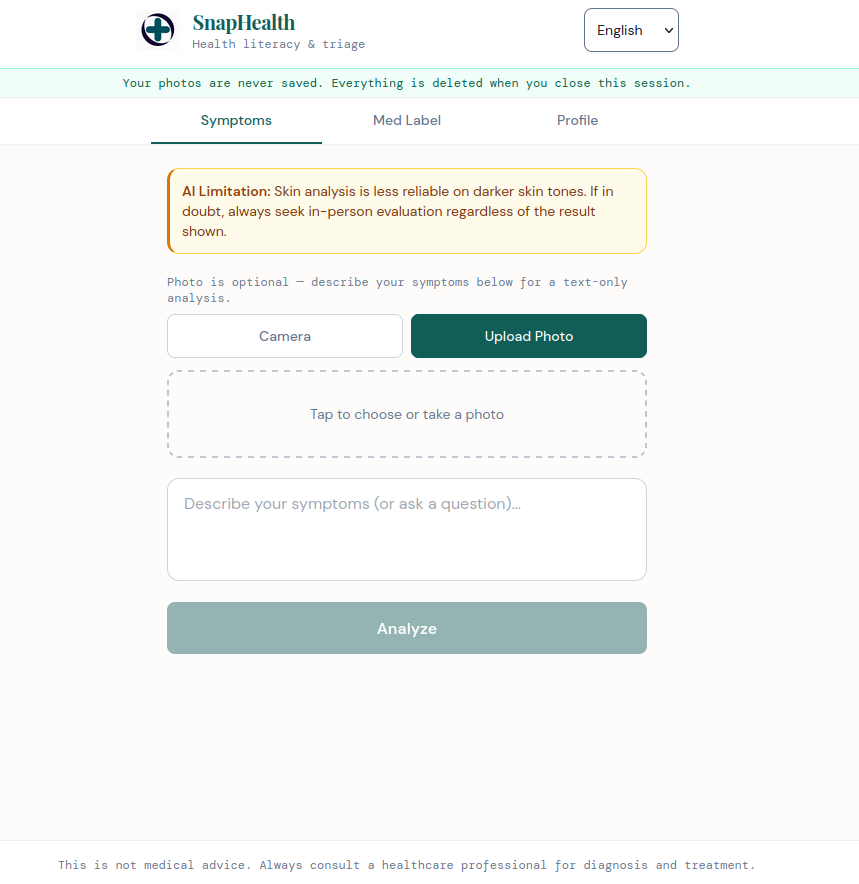
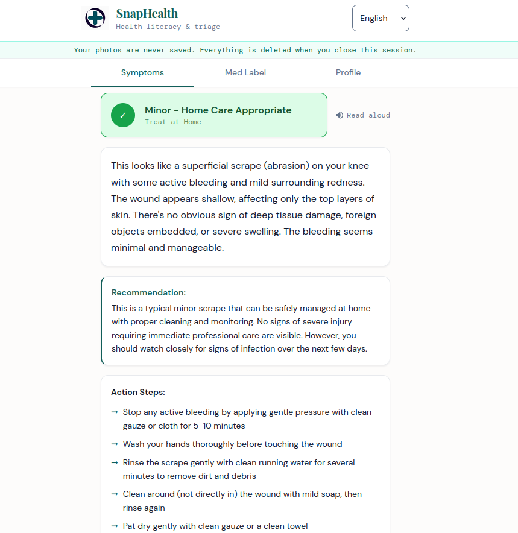

# SnapHealth

An AI-powered health literacy and triage tool for people who don't have easy access to medical guidance.

## The Problem

Healthcare literacy is one of the most unevenly distributed resources in the world. Whether you're uninsured, dealing with a language barrier, or unable to get a timely appointment, understanding what's happening to yourself is a privilege many don't have. That gap leaves them guessing about symptoms they're scared to ignore and medications they don't fully understand.

## The Solution

SnapHealth puts a knowledgeable and calm first voice in the room. Users can describe their symptoms in plain text, upload a photo of a wound or skin condition, or point their camera at a medication label and receive a clear, structured assessment in plain English. It doesn't replace a doctor. It helps people understand what they're looking at well enough to take the right next step.

## Screenshots

**Symptom Analysis**


**Med Label Analysis**


**Profile**


**Example Output**


## Flow

1. The user optionally fills out a health profile (age, sex, height, weight, conditions, medications, allergies) stored locally on their device
2. They describe a symptom or upload a photo on the Symptom or Med Label tab
3. The frontend resizes and encodes the image client-side before sending it to the backend (no raw images are stored)
4. The FastAPI backend forms a structured prompt combining the optional profile context, the user's input, and any prior conversation history, then sends it to ClaudeAPI
5. ClaudeAPI returns a severity assessment (`green` / `yellow` / `red` / `call_911`), a plain language explanation, action steps, potential warning signs, and a scripted statement the user can read aloud when they arrive at a clinic or doctor's office
6. The user can continue the conversation in a follow up chat window. Some conversation history is sent with each request so Claude maintains context without any server side storage

## Features

- **Symptom analysis** - photo (optional) or text description, or both
- **Medication decoder** - reads a prescription label and explains what the drug is, what it's for, common dosage instructions, and the 3 to 5 most clinically relevant side effects
- **Drug interaction check** - cross-references the analyzed medication against the user's profile medications
- **Severity flags** - the interface state is locked by severity level. A `call_911` result replaces the entire UI with an emergency screen and a direct dial button
- **Follow up chat** - full conversational follow up chat after any analysis, with history preserved across turns
- **Voice input** - microphone input on all text fields via the Web Speech API
- **Read aloud** - results can be read aloud using the browser's Speech Synthesis API with an explicit preference for high-quality English voices
- **Health profile** - optional on-device profile that injects age, sex, known conditions, and medications into every analysis for improved accuracy
- **Bias transparency** - every skin analysis explicitly acknowledges reduced reliability on darker skin tones, and the model is instructed to escalate rather than downgrade when image quality or skin tone creates ambiguity
- **Multilingual** - English and Spanish supported
- **Zero persistence** - no photos, no health data, and no session history are stored on the server

## Tech Stack

| Layer | Technology |
|---|---|
| Frontend | React 18, Vite, Tailwind CSS v3, Framer Motion |
| Backend | FastAPI, Python 3, Pydantic v2, uvicorn |
| AI | Anthropic Claude (claude-sonnet-4-5) with vision |
| Rate limiting | slowapi |
| Storage | localStorage only |

## Architecture

```
frontend/
  src/
    pages/          # AnalyzeBody, AnalyzeLabel, Profile
    components/     # CameraCapture, ChatWindow, SeverityBadge, ...
    hooks/          # useProfile (localStorage), useVoiceInput, useVoiceSpeech
    services/       # api.js (Axios layer)

backend/
  routes/           # analyze.py, chat.py, health.py
  services/
    claude.py       # All ClaudeAPI calls and system prompts
    parser.py       # JSON extraction from Claude responses
    profile_context.py  # Builds profile text block
  utils/
    bias_fallback.py    # always returns yellow on error
  models.py         # Pydantic request models
```

**Key design decisions:**

- Images are resized to a maximum of 800px wide and converted to JPEG on the client before upload to reduce payload size and latency
- Backend is stateless, frontend sends some conversation history on every chat request. The server trims it if it grows too large but keeps the first message (contains the image context)
- Claude calls are wrapped in try/except with any failure silently returning the `BIAS_SAFE_FALLBACK` object
- Rate limiting is applied per IP: 3 requests/minute on analysis endpoints, 20 requests/minute on chat

## Ethical Considerations

SnapHealth was built with the risks involved with AI-assisted health tools in mind

- **Not a diagnostic tool.** ClaudeAPI is instructed never to use the word "diagnose" and to always frame assessments as "may be consistent with" rather than definitive conclusions to comply with HIPAA
- **Emergency override.** Any `call_911` flag locks the interface entirely and displays only an emergency screen with a direct dial button
- **Bias acknowledgment.** Skin condition analysis is documented to be less reliable on darker skin tones because of training data limitations, so the model is explicitly instructed to flag this in every all skin assessments and to escalate instead of downgrading
- **No assumptions about access.** The model is instructed not to assume the user has insurance, a primary care physician, or an urgent care center nearby
- **Crisis detection.** Any mention of self harm disables analysis entirely and surfaces only crisis resources (988 Suicide & Crisis Lifeline)
- **Privacy by design.** No health data, images, or conversation history is stored on the server. The health profile stays in the user's browser localStorage and can be deleted at any time with a button

## Running Locally

**Backend**
```bash
cd backend
python -m venv .venv
source .venv/bin/activate
pip install -r requirements.txt
uvicorn main:app --reload
```
Add ANTHROPIC_API_KEY to .env in SnapHealth/backend

**Frontend**
```bash
cd frontend
npm install
npm run dev
```

The frontend runs on `http://localhost:5173` and proxies all API calls to `http://localhost:8000`

## Future Work

- **Telemedicine handoff** - generate a structured summary that can be exported or shared directly with a clinic or telehealth provider
- **Offline mode** - integrating an on-device model for areas with poor or no service
- **Broader language support** - expand beyond English and Spanish
- **Accessibility improvements** - full screen-reader audit, high-contrast mode, and larger text options
- **Follow-up reminders** - optional browser notifications to prompt users to check back on monitored symptoms

## Disclaimer

SnapHealth is a health literacy tool, not a medical device. It does not provide diagnoses or medical advice. Always consult a qualified healthcare professional for medical decisions.
